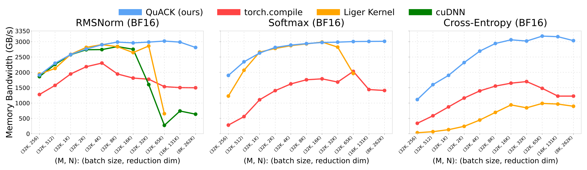
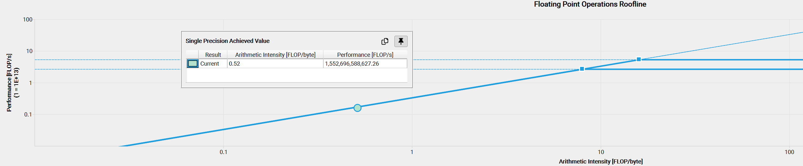
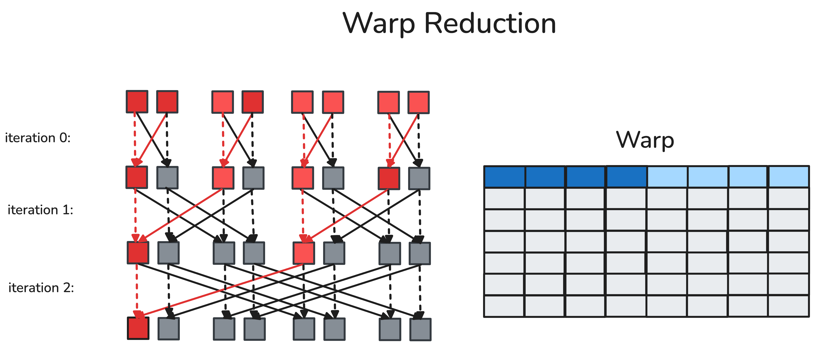
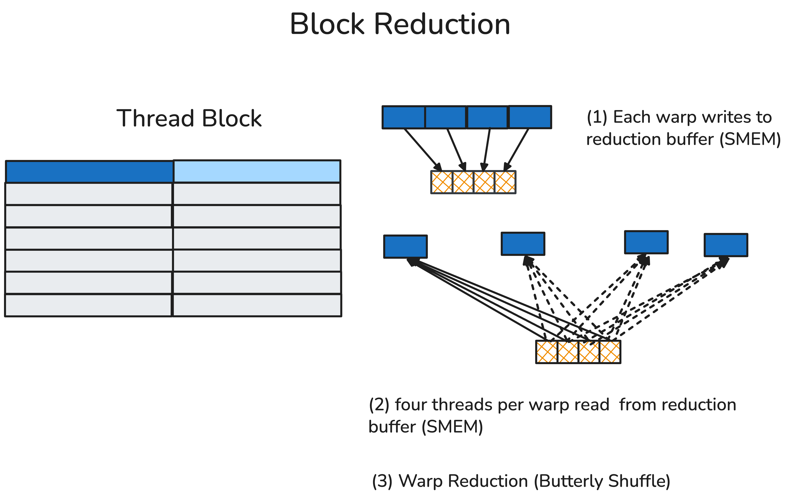
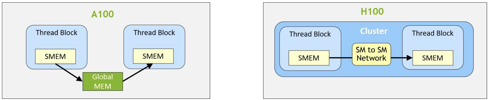
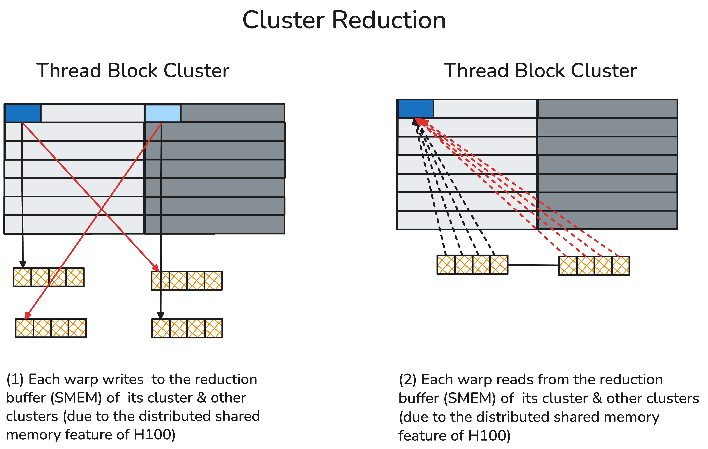
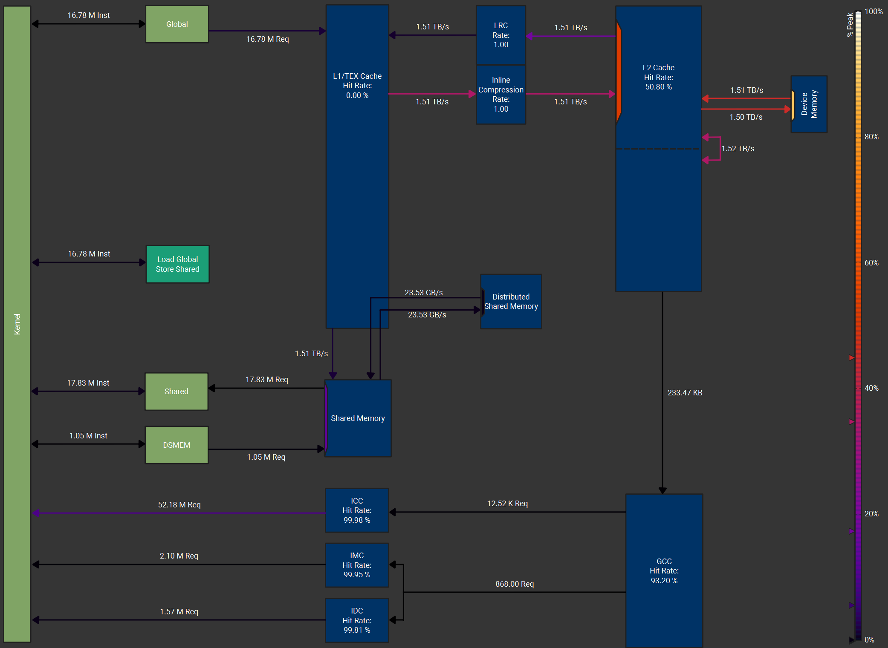
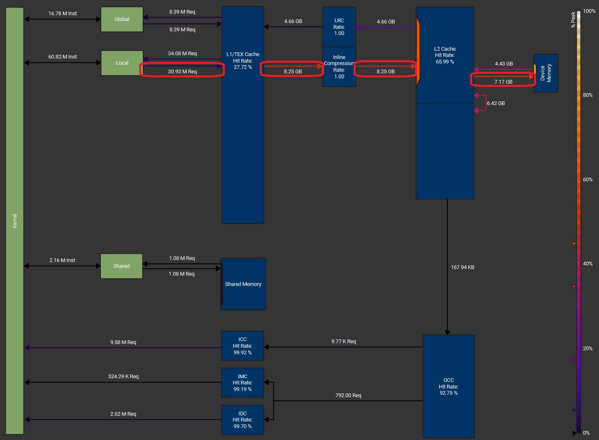
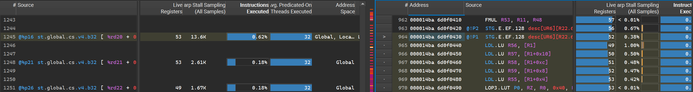
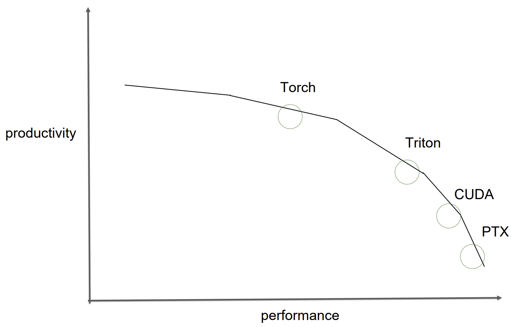

# Getting Memory-bound Kernels to Speed-of-Light
Wentao Guo, Ted Zadouri, Tri Dao

<div align="center">
<figure>
  
</figure>
</div>


To make GPUs go brrr for both model training and inference, one has to optimize both compute-bound kernels (e.g. matmul, attention) and memory-bound kernels (pretty much everything else, such as elementwise, normalization, loss). [Matmul](https://docs.nvidia.com/cuda/cublas/) and [attention](https://github.com/Dao-AILab/flash-attention/tree/main) are already some of the most heavily optimized subroutines that we have. Here we instead focus on memory-bound kernels, where most of the time is spent on memory access (IO) instead of on actual computation. By understanding and exploiting the thread and memory hierarchy on modern accelerators, we can get these kernels to close to speed-of-light (as fast as theoretically possible). Thanks to the recent [CuTe-DSL](https://docs.nvidia.com/cutlass/media/docs/pythonDSL/cute_dsl_general/dsl_introduction.html), we can do so right in the comfort of an ergonomic Python environment, without having to touch CUDA C or C++.

For memory-bound kernels, the ratio between the number of Floating-point Operations (FLOPs) consumed and the number of bytes transferred is small (such ratio is called Arithmetic Intensity). Once a kernel’s arithmetic intensity enters the memory-bound regime, the kernel's throughput is determined by how many bytes/second the kernel can deliver rather than by FLOPs/second the kernel computes.

<div align="center">
<figure>
  
  <figcaption>Arithmetic intensity of a memory-bound softmax kernel is O(1)</figcaption>
</figure>
</div>


Within the memory-bound kernels, elementwise activation is usually easier to deal with — it is inherently perfectly parallel as there are no dependencies across the elements. However, reduction operations are also prevalent in DL operators such as softmax and RMSNorm, and they require an aggregation of all values. A parallel associative reduction algorithm will execute O(log(#reduced dim)) rounds of partial reduction across threads in different spatiality where our knowledge of GPU memory hierarchy would help.

<div align="center">
<figure>
  
  <figcaption>Parallel maximum reduction [1]</figcaption>
</figure>
</div>


In this blogpost, we describe how we can leverage the GPU memory hierarchy to implement efficient reduction kernels. As an example, we use CuTe DSL to implement 3 commonly used kernels in Large Language Models: RMSNorm, softmax, and cross entropy loss. We want to hit the maximum hardware throughput, or “GPU speed-of-light throughput”, and we need 2 ingredients: (1) global memory coalesce load/store (2) hardware-aware reduction strategy. As a bonus, we’ll also explain cluster reduction, a relatively new feature on Nvidia GPUs starting with Hopper (H100), and how that helps with very large reductions. This blogpost will explain the details of these ingredients and flesh out how they allow us to write speed-of-light kernels. Let’s start our journey!

<!--  -->

Our code can be found at 🦆 <https://github.com/Dao-AILab/quack> 🦆

## GPU Memory Hierarchy

Before we start to write the kernel code, we should first understand the modern GPU memory hierarchy. For now let’s focus on Hopper architecture GPU (e.g. H100) as an example.

On Hopper GPUs, the CUDA execution hierarchy now spans four tiers: **threads**, **thread blocks**, the new **thread block cluster**, and the full grid. Individual threads are executed in groups of **32-lane (each lane being a thread) warps** inside a Streaming Multiprocessor (SM); each thread block enjoys a unified 192-256 KB shared memory (SMEM) that all warps within the same thread block have access. H100’s thread cluster allows up to 16 thread blocks running on neighboring SMs to read, write, and perform atomics in one another’s shared memory via the Distributed Shared Memory (DSMEM) fabric. This is coordinated via low-latency cluster barriers and thus avoiding costly global-memory round-trips.

Every tier of memory has a read & write primitive available for local reduction. We will therefore develop a general reduction template in CuTe DSL and achieve speed-of-light throughput on H100 consistently across reduction dimensions from 256 to 262k.

<div align="center">
<figure>
  
  <figcaption>Memory Hierarchy in H100 [2]</figcaption>
</figure>
</div>


Hopper GPU’s Execution Granularity Meets Memory Hierarchy
| Execution Granularity       | Operating Memory              | Description                                                                                                                                           |
|----------------------------|-------------------------------|-------------------------------------------------------------------------------------------------------------------------------------------------------|
| Threads                    | Registers (1st memory tier)    | Each thread can own up to 255 registers.                                                                                                              |
| Warps                      | Registers (1st memory tier)    | Each warp has 32 consecutive threads, and it is the smallest parallel execution unit. Within the same warp, each thread can fetch registers owned by other threads via warp shuffle. |
| Thread Blocks              | Shared Memory (2nd memory tier)| Each thread block can contain up to 1024 threads or 16 warps. All threads within each thread block are executed on the same SM and can read/write to the same shared memory.          |
| Thread Block Clusters      | Distributed Shared Memory (3rd memory tier) | Neighboring (up to 16) thread blocks can read and write to others’ shared memory via a dedicated SM-to-SM network. This abstraction is “distributed shared memory”. |
| Grids                      | Global Memory                  | All threads within the same kernel can read and write to the global memory.                                                                          |

Each memory tier has distinct memory access latency and bandwidth. For example, it usually takes a few ns to access thread-owned registers, and ~10-20 ns for accessing shared memory. We will then see a significant jump in latency for L2 (~150-200 ns), and finally ~400ns for accessing DRAM. Similarly, for device-wide bandwidth, we usually observe >100 TB/s for accessing registers, ~20-30 TB/s for accessing SMEM, ~5-10 TB/s for accessing L2, and for memory-bound kernel, H100 HBM3’s 3.35 TB/s throughput is usually the bottleneck. To fully utilize our hardware, we should design our memory-bound kernels following the memory hierarchy: we preferably allocate most local reduction on higher memory level, and only forward on the small amount of locally-reduced values to the next memory level. Chris Fleetwood has a similar illustration on the latency of memory access in A100 (without thread block cluster) in his [blogpost](https://fleetwood.dev/posts/domain-specific-architectures) [3], and H100 adds an extra memory hierarchy abstraction between SMEM and GMEM.

<div align="center">
<figure>
  
  <figcaption>Latency of Memory Access in H100 [4]</figcaption>
</figure>
</div>


## Hardware-aware load & store strategy

Once we start to write the kernel code, the very first problem is always “how should we load the inputs and store the results?” For memory-bound kernels, the HBM’s 3.35 TB/s is usually the bottleneck, which means **we need to squeeze out every possible cent in the load & store strategy**.

Before we launch our kernels, we will first partition our input data by a certain **Thread-Value Layout** (TV-layout) (more information in the CuTe-DSL example [here](https://github.com/NVIDIA/cutlass/blob/main/examples/python/CuTeDSL/notebooks/elementwise_add.ipynb)). This determines how values across the reduction dimension will be loaded and handled by each thread.

As each thread will load the value from global memory (GMEM), we should ensure that each load carries the largest number of copy bits contiguously in the hardware. This technique is usually called memory coalescing or coalesced access to global memory, and the CUDA Best Practice Guide explains this concept in more detail [5].

<div align="center">
<figure>
  
  <figcaption>Coalesced memory access [5]</figcaption>
</figure>
</div>


In H100 this means each thread will hold a multiple of 128 bits = 4x FP32 or 8x BF16 values. So for FP32, this will group, or “vectorize,” 4 load & store transactions into a single memory transaction and maximize the throughput.

We will asynchronously load from GMEM to SMEM, and then vectorize the load to registers. After the final reduced result is available, we will directly store it to GMEM. Sometimes, we can reload inputs from GMEM/SMEM to registers to relieve the register usage, and prevent unnecessary [register spilling](https://developer.download.nvidia.com/CUDA/training/register_spilling.pdf).

The code snippet below is our load implementation in Python CuTe DSL. Here we omit the data type conversion and masking predicates for simplicity.

```python
# blkX: logical id -> address
blkX = ...

# allocate shared memory for the input vectors
smem = cutlass.utils.SmemAllocator()
sX   = smem.allocate_tensor(gX.element_type, ...)

# declare the copy atoms which will be used later for memory copy
copy_atom_load_X_async = cute.make_copy_atom(
                                cute.nvgpu.cpasync.CopyG2SOp(),
                                gX.element_type, num_bits_per_copy=128)

# create a tiled type given a TV partitioner and tiler
thr_copy_X_async = cute.make_tiled_copy(copy_atom_load_X_async,
                                        tv_layout,
                                        tiler_mn).get_slice(tidx)

# partition the inputs in gmem and smem with TV layout and tiler
tXgX = thr_copy_X_async.partition_S(blkX)
tXsX = thr_copy_X_async.partition_S(sX)

# allocate registers
tXrX = cute.make_fragment_like(tXgX)

# asynchronously copy inputs from gmem to smem
cute.copy(copy_atom_load_X_async, tXgX, tXsX)

# commit and wait until current async copy op finishes
cute.arch.cp_async_commit_group()
cute.arch.cp_async_wait_group(0)

# copy from smem to registers
cute.autovec_copy(tXsX, tXrX)
x = tXrX.load()
```

## Hardware-aware reduction strategy

After each thread holds a small input vector, we will start reducing them! Every reduction involves one or multiple full-row scans. Recall the fact that, going from top to bottom of the memory hierarchy, we have longer access latency and less bandwidth. We should perform a reduction that follows such hardware memory hierarchy: aggregate partial results as soon as they are resident in a higher tier of the memory pyramid and only forward the values reduced locally to the next memory tier.

We will reduce the values from top to bottom in the following table, and each step we will only load & store in the corresponding memory hierarchy.

Reduction strategy in different memory hierarchies
| Execution Granularity       | Operating Memory              | Reduction Strategy     |
|----------------------------|-------------------------------|------------------------|
| Threads                    | Registers                     | Thread reduction       |
| Warps                      | Registers                     | Warp reduction         |
| Thread Blocks              | Shared Memory                 | Block reduction        |
| Thread Block Clusters      | Distributed Shared Memory     | Cluster reduction      |
| Grids                      | Global Memory                 |                        |

### 1. Thread reduction (read and write to registers)

Each thread will reduce a multiple of vectorized loaded values locally. We use the member function `TensorSSA.reduce` where we provide an associative reduction operator `op`, an initial value before reduction `init_val`, and our reduction dimension `reduction_profile**.

<div align="center">
<figure>
  
</figure>
</div>

**CuTe member function**:
```python
TensorSSA.reduce(op, init_val, reduction_profile**
```

**Our example usage**:
```python
max_x = x.reduce(cute.ReductionOp.MAX, init_val=float('-inf'),
                 reduction_profile=0)
```


### 2. Warp reduction (read and write to registers)

A warp is a fixed group of 32 contiguous threads that would execute common instructions per cycle. (Synchronous) **warp reduction** allows each thread to read another thread’s register in one cycle via a dedicated shuffle network within the same warp. **After the butterfly warp reduction (see the schematic below), every thread in the same warp obtains the reduced value**.

We define a helper function `warp_reduce` that performs warp reduction with “ butterfly” reduction order. We will refer readers to the CUDA blog written by Yuan and Vinod [6] that explains warp-level primitives in detail.


**Our helper function**:
```python
@cute.jit
def warp_reduce(val: cute.Numeric,
                op: Callable,
                width: cutlass.Constexpr = 32) -> cute.Numeric:
    for i in range(int(math.log2(width))):
        # cute.arch.shuffle_sync_bfly will read from another thread's registers
        val = op(val, cute.arch.shuffle_sync_bfly(val, offset=1 << i))
    return val
```

**Our example usage**:
```python
   max_x  = x.reduce(cute.ReductionOp.MAX, init_val=float('-inf'),
                     reduction_profile=0)
   max_x  = warp_reduce(
        max_x, cute.arch.fmax,
        width=32, # every thread in a warp will participate in the warp reduction
    )
```

<div align="center">
<figure>
  
  <figcaption>Butterfly warp reduction, also named “xor warp shuffle” [7]</figcaption>
</figure>
</div>


### 3. Block reduction (read and write to shared memory)

A thread block usually composes multiple (up to 32 in H100) warps inside a thread block. In a block reduction, the first thread from each participating warp will write their warp-reduced value to a reduction buffer pre-allocated on the shared memory. After a block-level synchronization (barrier) that ensures every participating warp has finished writing, the top-laned threads of each warp will then read from the reduction buffer, and calculate the block-reduced value locally.

**Our helper function**:
```python
@cute.jit
def block_reduce(val: cute.Numeric,
                 op: Callable,
                 reduction_buffer: cute.Tensor,
                 init_val: cute.Numeric = 0.0) -> cute.Numeric:
    lane_idx, warp_idx = cute.arch.lane_idx(), cute.arch.warp_idx()
    warps_per_row      = reduction_buffer.shape[1]
    row_idx, col_idx  = warp_idx // warps_per_row, warp_idx % warps_per_row
    if lane_idx == 0:
        # thread in lane 0 of each warp will write the warp-reduced value to the reduction buffer
        reduction_buffer[row_idx, col_idx] = val
    # synchronize the write results
    cute.arch.barrier()

    block_reduce_val = init_val
    if lane_idx < warps_per_row:
        # top-laned threads of each warp will read from the buffer
        block_reduce_val = reduction_buffer[row_idx, lane_idx]
    # then warp-reduce to get the block-reduced result
    return warp_reduce(block_reduce_val, op)
```

**Our example usage**:
```python
max_x = block_reduce(max_x, cute.arch.fmax, max_val_reduction_buffer,
                     init_val=max_x)
```

<div align="center">
<figure>
  
</figure>
</div>

### 4. Cluster reduction (read and write to distributed shared memory)

Thread block cluster is a newly introduced execution hierarchy in Hopper as a group of neighboring thread blocks (up to 16). Thread blocks within the same cluster will communicate with each other via distributed shared memory (DSMEM) that contains a dedicated fast SM-to-SM network.

Within the same cluster, all the threads can access other SM’s shared memory via DSMEM where the shared memory’s virtual address space is logically distributed across all the blocks in the cluster. DSMEM can be referenced directly with simple pointers.

<div align="center">
<figure>
  
  <figcaption>Distributed shared memory [8]</figcaption>
</figure>
</div>


In cluster reduction, we first send the current warp’s reduced value to all the peer thread block’s reduction buffer in peer’s SMEM. Such sending is conducted via a dedicated SM-to-SM fabric (as DSMEM). Then each warp fetches all warp’s values from their local reduction buffer, and reduces these values.

We also need a memory barrier to count the number of arrivals so that we don’t dereference our local shared memory too early (otherwise we will have illegal memory access).

<div align="center">
<figure>
  
</figure>
</div>

**Our helper function**:
```python
@dsl_user_op
def set_block_rank(smem_ptr: cute.Pointer,
                   peer_block_rank_in_cluster) -> cutlass.Int32:
    # This instruction maps the given smem pointer to the address at another thread block’s smem in the cluster.
    return inline_asm(...,
            "mapa.shared::cluster.u32 $0, $1, $2;",
            smem_ptr.toint(), peer_block_rank_in_cluster,
            ...
           )

@dsl_user_op
def store_shared_remote(val: float,
                        smem_ptr: cute.Pointer,
                        mbar_ptr: cute.Pointer,
                        peer_block_rank_in_cluster) -> None:
    # maps current reduction buffer’s pointer to the remote thread block’s SMEM addressable space.
    remote_smem_ptr_i32 = set_block_rank(
        smem_ptr, peer_block_rank_in_cluster
    )
    remote_mbar_ptr_i32 = set_block_rank(
        mbar_ptr, peer_block_rank_in_cluster
    )
    # asynchronously stores current warp’s reduced value `val` to the remote thread block’s reduction buffer.
    inline_asm(...,
        "st.async.shared::cluster.mbarrier::complete_tx::bytes.f32 [$0], $1, [$2];",
        remote_smem_ptr_i32, val, remote_mbar_ptr_i32,
        ...
    )

@cute.jit
def cluster_reduce(val: cute.Numeric,
                   op: Callable,
                   reduction_buffer: cute.Tensor,
                   mbar_ptr: cute.Pointer,
                   init_val: cute.Numeric = 0.0) -> cute.Numeric:
    block_rank_in_cluster    = cute.arch.block_idx_in_cluster()
    lane_idx, warp_idx       = cute.arch.lane_idx(), cute.arch.warp_idx()
    warps_per_row, cluster_n = reduction_buffer.shape[1]
    row_idx, col_idx = warp_idx // warps_per_row, warp_idx % warps_per_row

    if lane_idx < cluster_n:
        # `store_shared_remote` lets each top-laned write the warp-reduced value to cluster idx
        store_shared_remote(
            val,
            # `elem_pointer` calculates the pointer offset that we should write in another thread block
            elem_pointer(reduction_buffer,
                        (row_idx, (col_idx, block_rank_in_cluster))),
            mbar_ptr, peer_cta_rank_in_cluster=lane_idx
        )
   # ensure all participating warps have written the results
    cute.arch.mbarrier_wait(mbar_ptr, phase=0)

    block_reduce_val = init_val
    num_iter = cute.ceil_div(warps_per_row * cluster_n, 32)
    for i in cutlass.range_constexpr(num_iter):
        idx = lane_idx + i * 32
        if idx < cute.size(reduction_buffer, mode=[1]):
            # each lane reduces across the reduction buffer
            block_reduce_val = op(block_reduce_val,
                                   reduction_buffer[row_idx, idx])
    # warp reduce to obtain the final cluster-reduced result
    return warp_reduce(block_reduce_val, op)
```

**Our example usage**:
```python
max_val_mbar_ptr = smem.allocate(8, byte_alignment=8)

if tidx == 0:
     cute.arch.mbarrier_init(max_val_mbar_ptr, 1)


cute.arch.mbarrier_init_fence()
if tidx == 0:
    # initialize memory barrier transaction counter.
    cute.arch.mbarrier_arrive_and_expect_tx(max_val_mbar_ptr, num_warps *
                                            cluster_n * 4)
    # send an “arrive” signal after barrier init
    cute.arch.cluster_arrive_relaxed()
......
# wait until all warps in the cluster have initialized their local reduction buffer in their SMEM.
cute.arch.cluster_wait()
max_x = cluster_reduce(max_x, cute.arch.fmax, max_val_reduction_buffer,
                       max_val_mbar_ptr, init_val=max_x)

```

### Reduction from top to bottom


Let's put it together! We will first perform thread reduction, and aggregate our thread-reduced result within the same warp (warp reduction), and forward the reduced value again on each thread block or cluster depending on the number of reduction dimensions.

**Our example usage**:
```python
# load from GMEM to the thread-owned registers
x           = tXrX.load().to(cute.Float32)

# thread reduction
max_x       = x.reduce(cute.ReductionOp.MAX,
                       init_val=float('-inf'),
                       reduction_profile=0)

# warp reduction
max_x       = warp_reduce(
    max_x, cute.arch.fmax,
    width=32,
)

if cutlass.const_expr(warps_per_row * cluster_n) > 1:
    # more than 1 warp per row, block or cluster reduction is needed!
    if cutlass.const_expr(cluster_n) == 1:
        # block reduction
        max_x = block_reduce(max_x, cute.arch.fmax,
                             max_val_reduction_buffer,
                             init_val=max_x)
    else:
        # cluster reduction
        max_x = cluster_reduce(max_x, cute.arch.fmax,
                               max_val_reduction_buffer,
                               max_val_mbar_ptr,
                               init_val=max_x)
```


## NCU profile (softmax kernel)

### Our implementation

We profile our softmax kernel implementation with batch dim=16K, reduction dim=131K in NVIDIA H100 with HBM3 (DRAM peak throughput = 3.35 TB/s) [8]. The memory workload diagrams are generated from [Nsight Compute](https://docs.nvidia.com/nsight-compute/NsightComputeCli/index.html). We use a thread block cluster with size 4, 256 threads per thread block, and we use FP32 for the input data type. The load & store is vectorized with each instruction carrying 128 bits (4 FP32 values).

We achieve DRAM throughput (device memory throughput) at 3.01 TB/s which is 89.7% of the peak DRAM throughput. We also use DSMEM effectively besides SMEM.

<div align="center">
<figure>
  
  <figcaption>Our implementation’s memory workload diagram</figcaption>
</figure>
</div>

### Torch compile

We also compare our implementation with torch.compile (PyTorch version 2.7.1). We first obtain torch.compile’s generated Triton kernel codes as below.

This kernel implements softmax with 2 global memory loads (one load each when calculating row-wise max and partial exponential sums, and final softmax value) and 1 store. In this case, although this triton kernel still saturates the hardware DRAM throughput, the unnecessary 1 load would still cause the triton kernel’s effective model memory throughput (~2.0 TB/s) to be **two-third** of our impl’s (~3.0 TB/s).

Torch.compile’s generated Triton kernel (tuning config omitted)

```python
@triton.jit
def triton_red_fused__softmax_0(in_ptr0, out_ptr2, xnumel, r0_numel,
                           XBLOCK : tl.constexpr, R0_BLOCK : tl.constexpr):
    xnumel = 16384
    r0_numel = 131072
    rnumel = r0_numel
    RBLOCK: tl.constexpr = R0_BLOCK
    xoffset = tl.program_id(0).to(tl.int64) * XBLOCK
    xindex = xoffset + tl.arange(0, XBLOCK)[:, None].to(tl.int64)
    xmask = tl.full([XBLOCK, R0_BLOCK], True, tl.int1)
    r0_base = tl.arange(0, R0_BLOCK)[None, :].to(tl.int64)
    rbase = r0_base
    x0 = xindex
    _tmp2_max = tl.full([XBLOCK, R0_BLOCK], float('-inf'), tl.float32)
    _tmp2_sum = tl.zeros([XBLOCK, R0_BLOCK], tl.float32)
    for r0_offset in range(0, r0_numel, R0_BLOCK):
        r0_index = r0_offset + r0_base
        r0_mask = tl.full([XBLOCK, R0_BLOCK], True, tl.int1)
        roffset = r0_offset
        rindex = r0_index
        r0_1 = r0_index
        tmp0 = tl.load(in_ptr0 + (r0_1 + 131072*x0), None, eviction_policy='evict_last')
        tmp1 = tl.broadcast_to(tmp0, [XBLOCK, R0_BLOCK])

        _tmp2_max_next, _tmp2_sum_next = triton_helpers.online_softmax_combine(
             _tmp2_max, _tmp2_sum, tmp1, False
         )

        _tmp2_max = _tmp2_max_next
        _tmp2_sum = _tmp2_sum_next

    tmp4, tmp5 = triton_helpers.online_softmax_reduce(
        _tmp2_max, _tmp2_sum, 1, False)
    tmp4 = tmp4[:, None]
    tmp5 = tmp5[:, None]
    tmp2 = tmp4
    tmp3 = tmp5
    for r0_offset in range(0, r0_numel, R0_BLOCK):
        r0_index = r0_offset + r0_base
        r0_mask = tl.full([XBLOCK, R0_BLOCK], True, tl.int1)
        roffset = r0_offset
        rindex = r0_index
        r0_1 = r0_index
        tmp6 = tl.load(in_ptr0 + (r0_1 + 131072*x0), None, eviction_policy='evict_first')
        tmp7 = tmp6 - tmp2
        tmp8 = tl_math.exp(tmp7)
        tmp9 = (tmp8 / tmp3)
        tl.store(out_ptr2 + (r0_1 + 131072*x0), tmp9, None)
```

## Memory throughput

We benchmark our RMSNorm, softmax, cross entropy loss kernel as below. The benchmark is still conducted on 1 NVIDIA H100 80GB with HBM3 with Intel Xeon Platinum 8468 CPU.

We use a batch size from 8k to 32k, and a reduction dimension from 256 to 256 * 1024 = 262k with input data type as FP32 and BF16. Our baselines are listed below:
- Torch.compile (PyTorch 2.7.1). We use the default mode for compilation.
- Liger kernel v0.5.10. [13] We only benchmark RMSNorm and softmax up to a reduction dim 65k as the larger size is not supported yet by the Liger kernel.
- [cuDNN](https://docs.nvidia.com/deeplearning/cudnn/latest/) v9.10.1. We only benchmark the RMSNorm kernel.

Our impl in CuTe DSL generally maintains a model memory throughput about 3 TB/s (~90% peak) for a reduction dimension larger than 4k, and **achieves nearly double throughput (e.g., 3.01 TB/s vs 1.46 TB/s for FP32 softmax)** compared to torch.compile when reduction dimension is 262k. **Our impl also significantly outperforms all baselines when reduction dim >= 65k for all 3 kernels**.

<div align="center">
<figure>
  
  <figcaption>Model memory throughput of multiple kernels</figcaption>
</figure>
</div>

**We believe our outstanding performance at >= 65k input is due to our successful utilization of cluster reduction in H100**. When the size of inputs are ultra long and depleting the SM’s registers and shared memory, without cluster reduction, we would have to switch to an online algorithm (like online softmax) otherwise we may get a massive register spilling that leads to significant throughput degradation.

For example, we observe a significant performance degradation from ~3.0 TB/s to ~2.0 TB/s when we increase the input size from 32k to 65k with the Liger softmax kernel. By analyzing its memory workload chart and SASS code profile in NCU, we believe that a massive register spilling occurs with abnormally cascading write back to HBM as we are depleting each SM’s resources when we load 65k input per SM.

<div align="center">
<figure>
  
  <figcaption>Liger softmax kernel’s memory workload at batch, reduce dim (16k, 65k) with FP32</figcaption>
</figure>
</div>


<div align="center">
<figure>
  
  <figcaption>Liger softmax kernel’s register spills in assembly (LDL instruction)</figcaption>
</figure>
</div>

However, cluster reduction allows multiple SMs to coordinate with each other and share their individual SM to form a “mega” SM (DSMEM). **Suppose one SM can only handle 32k inputs, a cluster with size 16 will allow us to handle 0.5M input without reloading from GMEM. As we have a clear understanding of hardware knowledge, we can easily squeeze every byte from all memory hierarchies and achieve “speed-of-light” throughput even with the vanilla 3-pass softmax**.

## Conclusion

Hitting “speed-of-light” model memory throughput confirms that a carefully hand-crafted CuTe kernel can squeeze every byte across all memory hierarchies in the hardware. But that efficiency comes at the price of per-operator and even per input-shape tuning, which imposes a natural tradeoff between efficiency and development efforts. Phil Tillet (Triton author) articulates this really well with this figure in his [talk](https://semianalysis.com/wp-content/uploads/2025/03/Blackwell-Programming-for-the-Masses-With-OpenAI-Triton-Phil-Tillet.pdf). In our experience with CuTe-DSL, it has offered both the productivity of Python with the control and performance of CUDA C++.

<div align="center">
<figure>
  
  <figcaption>Productivity / Performance Pareto Frontier. From Phil Tillet’s [talk](https://semianalysis.com/wp-content/uploads/2025/03/Blackwell-Programming-for-the-Masses-With-OpenAI-Triton-Phil-Tillet.pdf).</figcaption>
</figure>
</div>

We believe that an efficient GPU kernel development process could be automated. **For example, the input tensor’s TV-layout, load/store strategies, and reduction helper functions in RMSNorm can be directly applied in the softmax kernel and still achieve similar throughput**. Additionally, CuTe DSL would enable agile GPU kernel development on developer side or another codegen application operating on top of CuTe DSL. There is also an active research interest on applying LLM to auto-generate GPU kernels, and in the future, we may just call “LLM.compile” to generate highly-optimized GPU kernels.

#### Acknowledgments

Huge thanks to the Nvidia Cutlass team for the awesome CuTe-DSL. Thanks to Yinwei Dai, Rui Pan, Mayank Mishra, Berlin Chen, Songlin Yang, and Xinyu Yang for feedback and suggestions that have improved this blogpost.
