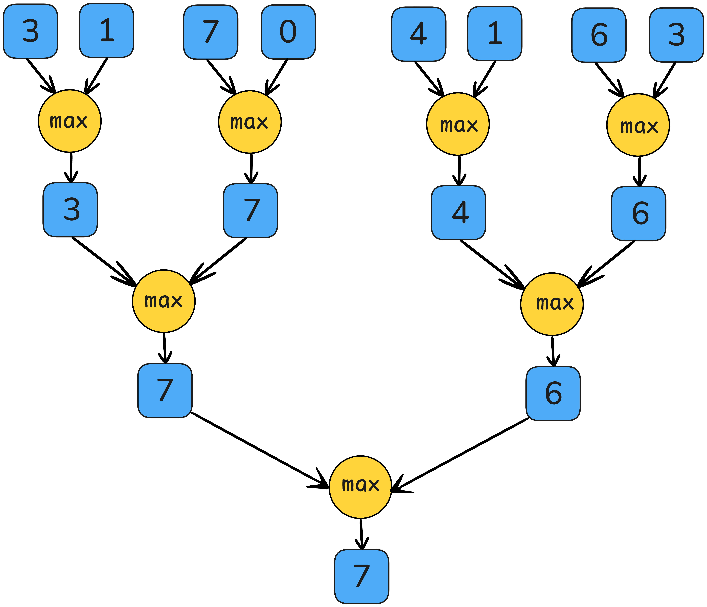
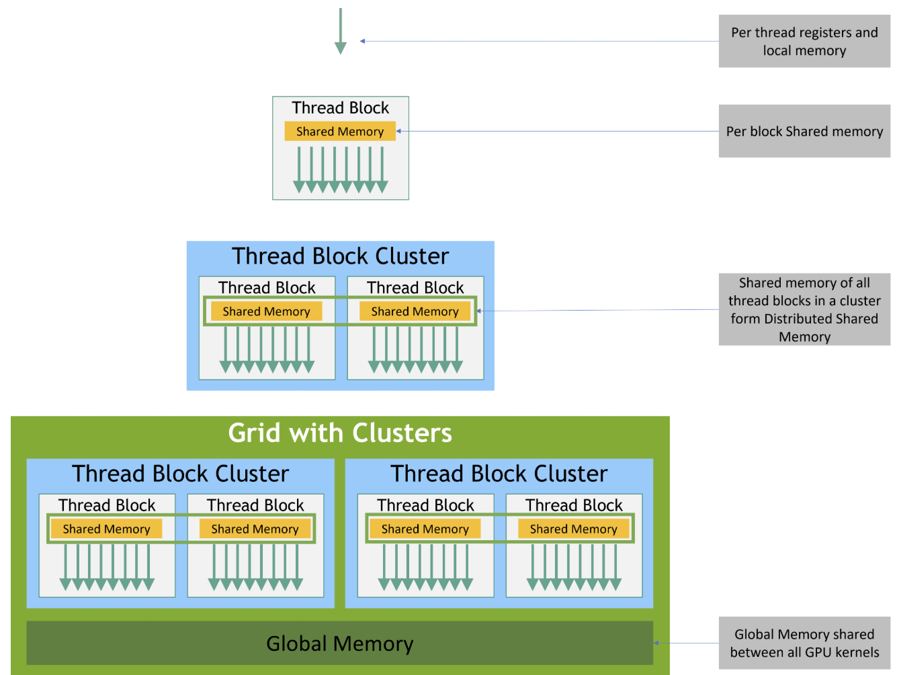
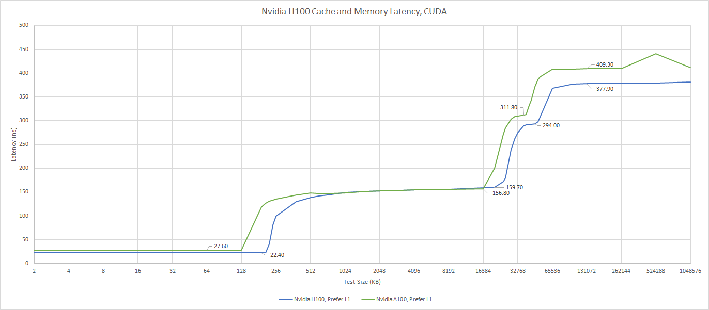
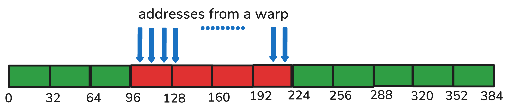
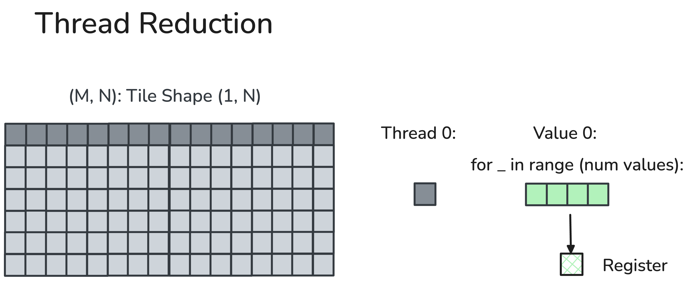

# Getting Memory-bound Kernels to Speed-of-Light
Wentao Guo, Ted Zadouri, Tri Dao

To make GPUs go brrr for both model training and inference, one has to optimize both compute-bound kernels (e.g. matmul, attention) and memory-bound kernels (pretty much everything else, such as elementwise, normalization, loss). [Matmul](https://docs.nvidia.com/cuda/cublas/) and [attention](https://github.com/Dao-AILab/flash-attention/tree/main) are already some of the most heavily optimized subroutines that we have. Here we instead focus on memory-bound kernels, where most of the time is spent on memory access (IO) instead of on actual computation. By understanding and exploiting the thread and memory hierarchy on modern accelerators, we can get these kernels to close to speed-of-light (as fast as theoretically possible). Thanks to the recent [CuTe-DSL](https://docs.nvidia.com/cutlass/media/docs/pythonDSL/cute_dsl_general/dsl_introduction.html), we can do so right in the comfort of an ergonomic Python environment, without having to touch CUDA C or C++.

For memory-bound kernels, the ratio between the number of Floating-point Operations (FLOPs) consumed and the number of bytes transferred is small (such ratio is called Arithmetic Intensity). Once a kernel’s arithmetic intensity enters the memory-bound regime, the kernel's throughput is determined by how many bytes/second the kernel can deliver rather than by FLOPs/second the kernel computes.

<div align="center">
<figure>
  
  <figcaption>Arithmetic intensity of a memory-bound softmax kernel is O(1)</figcaption>
</figure>
</div>


Within the memory-bound kernels, elementwise activation is usually easier to deal with — it is inherently perfectly parallel as there are no dependencies across the elements. However, reduction operations are also prevalent in DL operators such as softmax and RMSNorm, and they require an aggregation of all values. A parallel associative reduction algorithm will execute O(log(#reduced dim)) rounds of partial reduction across threads in different spatiality where our knowledge of GPU memory hierarchy would help.

<div align="center">
<figure>
  
  <figcaption>Parallel maximum reduction [1]</figcaption>
</figure>
</div>


In this blogpost, we describe how we can leverage the GPU memory hierarchy to implement efficient reduction kernels. As an example, we use CuTe DSL to implement 3 commonly used kernels in Large Language Models: RMSNorm, softmax, and cross entropy loss. We want to hit the maximum hardware throughput, or “GPU speed-of-light throughput”, and we need 2 ingredients: (1) global memory coalesce load/store (2) hardware-aware reduction strategy. As a bonus, we’ll also explain cluster reduction, a relatively new feature on Nvidia GPUs starting with Hopper (H100), and how that helps with very large reductions. This blogpost will explain the details of these ingredients and flesh out how they allow us to write speed-of-light kernels. Let’s start our journey!

<!--  -->

Our code can be found at 🦆 <https://github.com/Dao-AILab/quack> 🦆

## GPU Memory Hierarchy

Before we start to write the kernel code, we should first understand the modern GPU memory hierarchy. For now let’s focus on Hopper architecture GPU (e.g. H100) as an example.

On Hopper GPUs, the CUDA execution hierarchy now spans four tiers: **threads**, **thread blocks**, the new **thread block cluster**, and the full grid. Individual threads are executed in groups of **32-lane (each lane being a thread) warps** inside a Streaming Multiprocessor (SM); each thread block enjoys a unified 192-256 KB shared memory (SMEM) that all warps within the same thread block have access. H100’s thread cluster allows up to 16 thread blocks running on neighboring SMs to read, write, and perform atomics in one another’s shared memory via the Distributed Shared Memory (DSMEM) fabric. This is coordinated via low-latency cluster barriers and thus avoiding costly global-memory round-trips.

Every tier of memory has a read & write primitive available for local reduction. We will therefore develop a general reduction template in CuTe DSL and achieve speed-of-light throughput on H100 consistently across reduction dimensions from 256 to 262k.

<div align="center">
<figure>
  
  <figcaption>Memory Hierarchy in H100 [2]</figcaption>
</figure>
</div>


Hopper GPU’s Execution Granularity Meets Memory Hierarchy
| Execution Granularity       | Operating Memory              | Description                                                                                                                                           |
|----------------------------|-------------------------------|-------------------------------------------------------------------------------------------------------------------------------------------------------|
| Threads                    | Registers (1st memory tier)    | Each thread can own up to 255 registers.                                                                                                              |
| Warps                      | Registers (1st memory tier)    | Each warp has 32 consecutive threads, and it is the smallest parallel execution unit. Within the same warp, each thread can fetch registers owned by other threads via warp shuffle. |
| Thread Blocks              | Shared Memory (2nd memory tier)| Each thread block can contain up to 1024 threads or 16 warps. All threads within each thread block are executed on the same SM and can read/write to the same shared memory.          |
| Thread Block Clusters      | Distributed Shared Memory (3rd memory tier) | Neighboring (up to 16) thread blocks can read and write to others’ shared memory via a dedicated SM-to-SM network. This abstraction is “distributed shared memory”. |
| Grids                      | Global Memory                  | All threads within the same kernel can read and write to the global memory.                                                                          |

Each memory tier has distinct memory access latency and bandwidth. For example, it usually takes a few ns to access thread-owned registers, and ~10-20 ns for accessing shared memory. We will then see a significant jump in latency for L2 (~150-200 ns), and finally ~400ns for accessing DRAM. Similarly, for device-wide bandwidth, we usually observe >100 TB/s for accessing registers, ~20-30 TB/s for accessing SMEM, ~5-10 TB/s for accessing L2, and for memory-bound kernel, H100 HBM3’s 3.35 TB/s throughput is usually the bottleneck. To fully utilize our hardware, we should design our memory-bound kernels following the memory hierarchy: we preferably allocate most local reduction on higher memory level, and only forward on the small amount of locally-reduced values to the next memory level. Chris Fleetwood has a similar illustration on the latency of memory access in A100 (without thread block cluster) in his [blogpost](https://fleetwood.dev/posts/domain-specific-architectures) [3], and H100 adds an extra memory hierarchy abstraction between SMEM and GMEM.

<div align="center">
<figure>
  
  <figcaption>Latency of Memory Access in H100 [4]</figcaption>
</figure>
</div>


## Hardware-aware load & store strategy

Once we start to write the kernel code, the very first problem is always “how should we load the inputs and store the results?” For memory-bound kernels, the HBM’s 3.35 TB/s is usually the bottleneck, which means **we need to squeeze out every possible cent in the load & store strategy**.

Before we launch our kernels, we will first partition our input data by a certain **Thread-Value Layout** (TV-layout) (more information in the CuTe-DSL example [here](https://github.com/NVIDIA/cutlass/blob/main/examples/python/CuTeDSL/notebooks/elementwise_add.ipynb)). This determines how values across the reduction dimension will be loaded and handled by each thread.

As each thread will load the value from global memory (GMEM), we should ensure that each load carries the largest number of copy bits contiguously in the hardware. This technique is usually called memory coalescing or coalesced access to global memory, and the CUDA Best Practice Guide explains this concept in more detail [5].

<div align="center">
<figure>
  
  <figcaption>Coalesced memory access [5]</figcaption>
</figure>
</div>


In H100 this means each thread will hold a multiple of 128 bits = 4x FP32 or 8x BF16 values. So for FP32, this will group, or “vectorize,” 4 load & store transactions into a single memory transaction and maximize the throughput.

We will asynchronously load from GMEM to SMEM, and then vectorize the load to registers. After the final reduced result is available, we will directly store it to GMEM. Sometimes, we can reload inputs from GMEM/SMEM to registers to relieve the register usage, and prevent unnecessary [register spilling](https://developer.download.nvidia.com/CUDA/training/register_spilling.pdf).

The code snippet below is our load implementation in Python CuTe DSL. Here we omit the data type conversion and masking predicates for simplicity.

```python
# blkX: logical id -> address
blkX = ...

# allocate shared memory for the input vectors
smem = cutlass.utils.SmemAllocator()
sX   = smem.allocate_tensor(gX.element_type, ...)

# declare the copy atoms which will be used later for memory copy
copy_atom_load_X_async = cute.make_copy_atom(
                                cute.nvgpu.cpasync.CopyG2SOp(),
                                gX.element_type, num_bits_per_copy=128)

# create a tiled type given a TV partitioner and tiler
thr_copy_X_async = cute.make_tiled_copy(copy_atom_load_X_async,
                                        tv_layout,
                                        tiler_mn).get_slice(tidx)

# partition the inputs in gmem and smem with TV layout and tiler
tXgX = thr_copy_X_async.partition_S(blkX)
tXsX = thr_copy_X_async.partition_S(sX)

# allocate registers
tXrX = cute.make_fragment_like(tXgX)

# asynchronously copy inputs from gmem to smem
cute.copy(copy_atom_load_X_async, tXgX, tXsX)

# commit and wait until current async copy op finishes
cute.arch.cp_async_commit_group()
cute.arch.cp_async_wait_group(0)

# copy from smem to registers
cute.autovec_copy(tXsX, tXrX)
x = tXrX.load()
```

## Hardware-aware reduction strategy

After each thread holds a small input vector, we will start reducing them! Every reduction involves one or multiple full-row scans. Recall the fact that, going from top to bottom of the memory hierarchy, we have longer access latency and less bandwidth. We should perform a reduction that follows such hardware memory hierarchy: aggregate partial results as soon as they are resident in a higher tier of the memory pyramid and only forward the values reduced locally to the next memory tier.

We will reduce the values from top to bottom in the following table, and each step we will only load & store in the corresponding memory hierarchy.

Reduction strategy in different memory hierarchies
| Execution Granularity       | Operating Memory              | Reduction Strategy     |
|----------------------------|-------------------------------|------------------------|
| Threads                    | Registers                     | Thread reduction       |
| Warps                      | Registers                     | Warp reduction         |
| Thread Blocks              | Shared Memory                 | Block reduction        |
| Thread Block Clusters      | Distributed Shared Memory     | Cluster reduction      |
| Grids                      | Global Memory                 |                        |

1. Thread reduction (read and write to registers)

Each thread will reduce a multiple of vectorized loaded values locally. We use the member function `TensorSSA.reduce` where we provide an associative reduction operator `op`, an initial value before reduction `init_val`, and our reduction dimension `reduction_profile**.

<div align="center">
<figure>
  
</figure>
</div>

**CuTe member function**:
```python
TensorSSA.reduce(op, init_val, reduction_profile**
```

**Our example usage***:
```python
max_x = x.reduce(cute.ReductionOp.MAX, init_val=float('-inf'),
                 reduction_profile=0)
```
